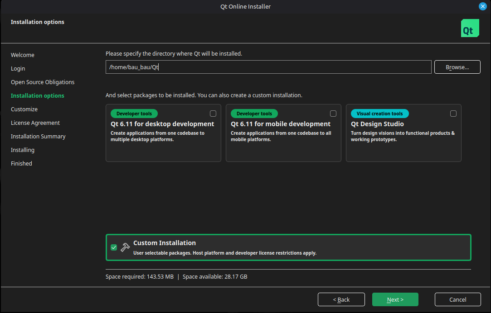
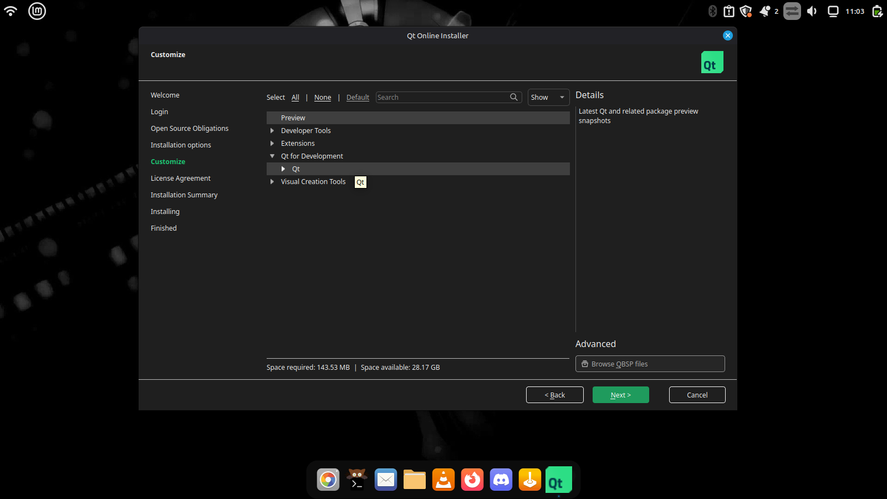
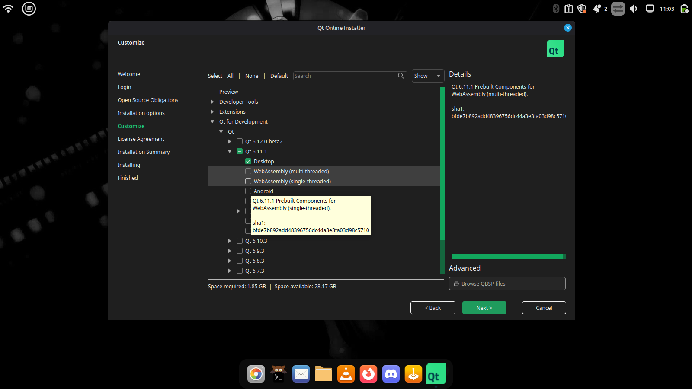
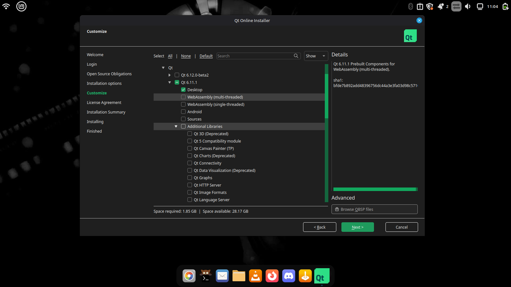
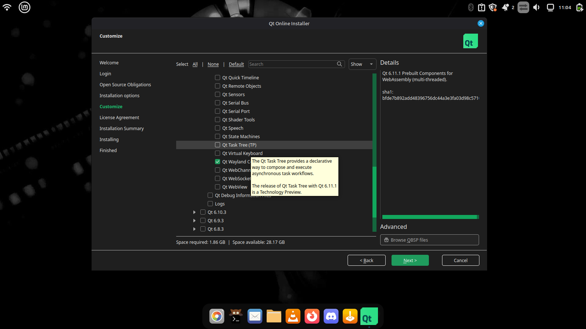
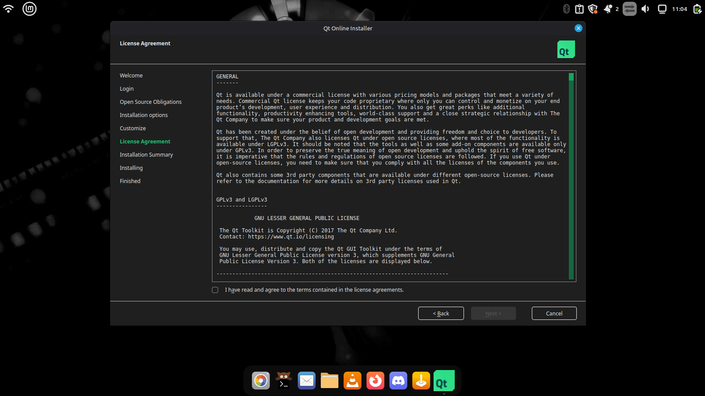
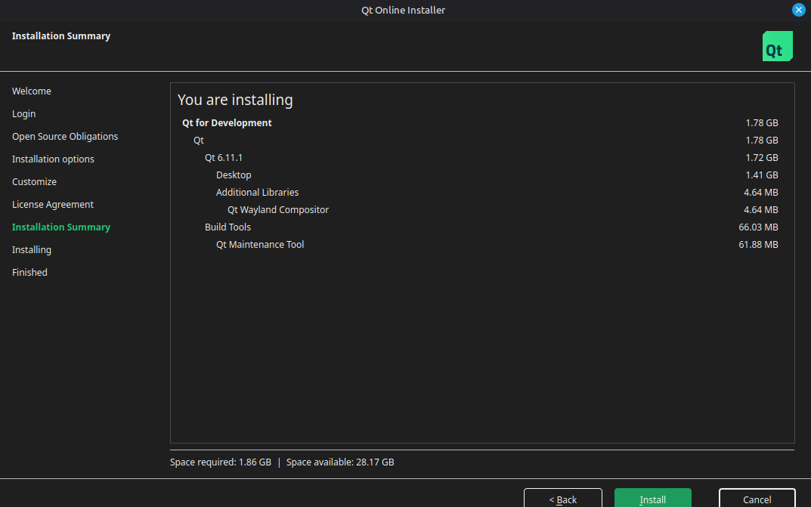

# Installing Caelestia Shell on Ubuntu/Linux Mint

A guide for installing **Caelestia Shell** on Ubuntu-based distributions (Ubuntu, Linux Mint, etc).

This guide is aimed at people who want Caelestia running on a normal Debian/Ubuntu system without installing the full Caelestia dots.

---

# Requirements

Before starting, make sure you have:

- A brain 🧠
- A computer 💻
- Fingers
- Hands
- A keyboard
- Patience

Software requirements:

- Linux Mint / Ubuntu based system
- Hyprland
- Qt 6.11
- Quickshell
- CMake
- Ninja
- Git

---

# 1. Install Hyprland

Caelestia is designed around Hyprland.

If you do not already have Hyprland installed, follow this guide:

https://github.com/LinuxBeginnings/Ubuntu-Hyprland

After installing Hyprland, make sure you can start a working Hyprland session before continuing.

---

# 2. Install Qt 6.11

## Create a Qt account

You need a Qt account to download the official installer.

Go to the Qt website:

https://www.qt.io/download

Download the Linux installer.

Run the installer:

```bash
chmod +x qt-online-installer-linux-x64-*.run
./qt-online-installer-linux-x64-*.run
```

Sign into your Qt account.

Continue until you reach the installation options.

---

## Qt Installer options

Choose:

```
Custom installation
```

Select:

```
Qt for development
```

Expand it.

Select:

```
Qt 6.11
```

Expand Qt 6.11.

Only install the required components.

Disable:

```
❌ Additional libraries
❌ Build Tools
```

Enable:

```
✅ Qt Wayland
```

Your installer should look similar to the following:















Finish the installation.

---

# 3. Install dependencies

Install required build tools:

```bash
sudo apt update

sudo apt install \
git \
cmake \
ninja-build \
build-essential \
qt6-base-dev \
qt6-declarative-dev \
qt6-wayland \
libwayland-dev
```

---

# 4. Install Quickshell

## Option 1 (Recommended)

Quickshell is available from the DankLinux packages.

Add the repository:

```bash
sudo add-apt-repository ppa:avengemedia/danklinux

sudo apt update
```

Install the latest release:

```bash
sudo apt install quickshell
```

or install the git version:

```bash
sudo apt install quickshell-git
```

---

## Option 2: Build Quickshell manually

Only do this if packages do not work.

Clone:

```bash
git clone https://github.com/quickshell-mirror/quickshell.git
cd quickshell
```

Build:

```bash
cmake -B build -G Ninja -DCMAKE_BUILD_TYPE=Release

cmake --build build
```

Install:

```bash
sudo cmake --install build
```

---

# 5. Install Caelestia dependencies

Install:

```bash
sudo apt install \
ddcutil \
brightnessctl \
libcava-dev \
network-manager \
lm-sensors \
fish \
aubio-tools \
libpipewire-0.3-dev \
libqalculate-dev \
swappy
```

---

# 6. Install cpptrace

Caelestia uses cpptrace for debugging.

Install:

```bash
git clone https://github.com/jeremy-rifkin/cpptrace.git

cd cpptrace

cmake -B build -G Ninja -DCMAKE_BUILD_TYPE=Release

cmake --build build

sudo cmake --install build
```

---

## Skipping cpptrace

If you do not want cpptrace, you can remove the dependency.

Clone Caelestia:

```bash
git clone https://github.com/caelestia-dots/shell.git
cd shell
```

Configure without optional features:

```bash
cmake -B build \
-G Ninja \
-DCMAKE_BUILD_TYPE=Release
```

Then build:

```bash
cmake --build build
```

---

# 7. Install Caelestia Shell

Clone the repository:

```bash
mkdir -p ~/.config/quickshell

cd ~/.config/quickshell

git clone https://github.com/caelestia-dots/shell.git caelestia
```

Enter the folder:

```bash
cd caelestia
```

Build:

```bash
cmake -B build \
-G Ninja \
-DCMAKE_BUILD_TYPE=Release \
-DCMAKE_INSTALL_PREFIX=/
```

Compile:

```bash
cmake --build build
```

Install:

```bash
sudo cmake --install build
```

---

# 8. Starting Caelestia

Run:

```bash
caelestia shell -d
```

or:

```bash
qs -c caelestia
```

---

# 9. Updating Caelestia

When a new Caelestia release comes out:

Go to your installation:

```bash
cd ~/.config/quickshell/caelestia
```

Check your branch:

```bash
git status
```

If you are on a release tag:

Example:

```
HEAD detached at v2.2.0
```

switch back to main:

```bash
git checkout main
```

Update:

```bash
git pull
```

Rebuild:

```bash
cmake --build build
```

Install:

```bash
sudo cmake --install build
```

---

# 10. Configuration

Caelestia configuration is stored here:

```
~/.config/caelestia/
```

Main configuration:

```
shell.json
```

Example:

```
~/.config/caelestia/shell.json
```

---

# Troubleshooting

## Qt not found

Check:

```bash
echo $CMAKE_PREFIX_PATH
```

Example:

```
/home/user/Qt/6.11.1/gcc_64
```

If missing:

```bash
export CMAKE_PREFIX_PATH=$HOME/Qt/6.11.1/gcc_64
```

---

## QML modules missing

Check:

```bash
echo $QML_IMPORT_PATH
```

Example:

```
/usr/lib/qt6/qml
```

---

## Hyprland does not start

Make sure Hyprland works before launching Caelestia.

Caelestia is a shell, not a window manager.

---

# Credits

Caelestia Shell:
https://github.com/caelestia-dots/shell

Quickshell:
https://quickshell.outfoxxed.me

Hyprland:
https://hyprland.org

Ubuntu Hyprland guide:
https://github.com/LinuxBeginnings/Ubuntu-Hyprland
