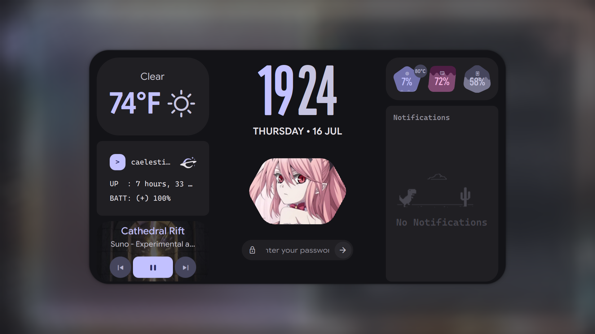

# Caelestia Shell Installation Guide (Ubuntu / Linux Mint)

A guide for installing **Caelestia Shell** on Ubuntu-based distributions such as Ubuntu and Linux Mint.


# Preview 



2. [Install Hyprland](#1-install-hyprland)
3. [Install Qt 6.11.1](#2-install-qt-6111)
4. [Install System Dependencies](#3-install-system-dependencies)
5. [Install Quickshell](#4-install-quickshell)
6. [Install Caelestia Dependencies](#5-install-caelestia-dependencies)
7. [cpptrace (Optional)](#6-cpptrace-optional)
8. [Install Caelestia Shell](#7-install-caelestia-shell)
9. [Running Caelestia](#8-running-caelestia)
10. [Updating Caelestia](#9-updating-caelestia)
11. [Configuration](#10-configuration)
12. [Complete Hyprland Configuration](#complete-hyprland-configuration)
13. [Complete Keybinding Reference](#complete-keybinding-reference)
14. [Troubleshooting](#troubleshooting)
15. [Credits](#credits)

---

# Requirements

Before starting, make sure you have:

- A brain 🧠
- A computer 💻
- Fingers
- Hands
- A keyboard
- Patience

Software requirements:

- Linux Mint / Ubuntu based system
- Hyprland
- Qt 6.11.1
- Quickshell
- CMake
- Ninja
- Git

---

# 1. Install Hyprland

Caelestia Shell runs on top of Hyprland.

If you do not already have Hyprland installed, follow:

https://github.com/LinuxBeginnings/Ubuntu-Hyprland

Make sure Hyprland launches correctly before continuing.

Caelestia is only the desktop shell. It is not a window manager.

---

# 2. Install Qt 6.11.1

## Create a Qt account

You need a Qt account to download the official installer.

Go to:

https://www.qt.io/development/download-qt-installer-oss

Download the Linux installer.

Run:

```bash
chmod +x qt-online-installer-linux-x64-*.run
./qt-online-installer-linux-x64-*.run
```

Sign in with your Qt account and continue.

---

## Qt Installer Setup

**Step 1: Select Installation Type**
When asked for the installation type, select:

```
Custom installation
```


*Screenshot: Selecting "Custom installation" during Qt setup.*

---

**Step 2: Select Qt for Development**
Expand:

```
Qt for development
```


*Screenshot: Expanding "Qt for development" section.*

Then expand:

```
Qt
```

---

**Step 3: Choose Qt Version**
Expand:

```
Qt 6.11.1
```

Inside Qt 6.11.1 select:

```
Desktop
```

Only select the desktop component. Do not select unnecessary platforms.


*Screenshot: Selecting "Desktop" under Qt 6.11.1.*

---

**Step 4: Add Qt Wayland**
Expand:

```
Additional libraries
```

under Qt 6.11.1.


*Screenshot: Expanding "Additional libraries" section.*

Scroll down until you find:

```
Qt Wayland
```

Select:

```
Qt Wayland
```

This is required for Wayland applications.


*Screenshot: Selecting "Qt Wayland" from Additional libraries.*

---

**Step 5: Skip Build Tools**
Do not install:

```
Build Tools
```

They are not required. We will use GCC, CMake, and Ninja from the system.

---

**Step 6: Accept License**
Accept the Qt license agreement.


*Screenshot: Accepting the Qt license agreement.*

---

**Step 7: Verify Selection**
Before installing, make sure your selected components look like this:

- Qt 6.11.1 → Desktop
- Qt 6.11.1 → Additional Libraries → Qt Wayland


*Screenshot: Final component selection before installation.*

Continue the installation.

---

# 3. Install System Dependencies

Install required tools:

```bash
sudo apt update
sudo apt install git cmake ninja-build build-essential
```

---

# 4. Install Quickshell

## Recommended method

Quickshell is available from the DankLinux repository.

Add the repository:

```bash
sudo add-apt-repository ppa:avengemedia/danklinux
sudo apt update
```

Install the stable version:

```bash
sudo apt install quickshell
```

or install the latest git version:

```bash
sudo apt install quickshell-git
```

---

# 5. Install Caelestia Dependencies

Install required libraries:

```bash
sudo apt install \
ddcutil \
brightnessctl \
network-manager \
lm-sensors \
fish \
libpipewire-0.3-dev \
libqalculate-dev \
swappy
```

| Package | Feature |
|---------|---------|
| ddcutil | Monitor brightness control |
| brightnessctl | Laptop brightness |
| network-manager | Network widget |
| lm-sensors | Hardware monitoring |
| fish | Shell utilities |
| PipeWire | Audio visualiser |
| libqalculate | Calculator |
| swappy | Screenshot editing |

---

# 6. cpptrace (Optional)

Caelestia can use cpptrace for debugging. Most users can skip this. Only install it if CMake complains about missing cpptrace.

Install cpptrace:

```bash
git clone https://github.com/jeremy-rifkin/cpptrace.git
cd cpptrace
cmake -B build -G Ninja -DCMAKE_BUILD_TYPE=Release
cmake --build build
sudo cmake --install build
cd ..
```

---

# 7. Install Caelestia Shell

Create the Quickshell directory:

```bash
mkdir -p ~/.config/quickshell
```

Clone Caelestia:

```bash
cd ~/.config/quickshell
git clone https://github.com/caelestia-dots/shell.git caelestia
```

Enter:

```bash
cd caelestia
```

Configure:

```bash
cmake -B build \
-G Ninja \
-DCMAKE_BUILD_TYPE=Release \
-DCMAKE_INSTALL_PREFIX=/
```

Build:

```bash
cmake --build build
```

Install:

```bash
sudo cmake --install build
```

---

# 8. Running Caelestia

Start Caelestia:

```bash
caelestia shell -d
```

or:

```bash
qs -c caelestia
```

---

# 9. Updating Caelestia

If Caelestia releases a new version:

Go to your Caelestia folder:

```bash
cd ~/.config/quickshell/caelestia
```

Check your branch:

```bash
git status
```

If you see:

```
HEAD detached at vX.X.X
```

you are on a release tag.

Switch back to main:

```bash
git checkout main
```

Update:

```bash
git pull
```

Rebuild:

```bash
cmake --build build
```

Install again:

```bash
sudo cmake --install build
```

---

# 10. Configuration

Caelestia configuration:

```
~/.config/caelestia/
```

Main file:

```
shell.json
```

Example:

```
~/.config/caelestia/shell.json
```

---

# Complete Hyprland Configuration

Save this as `~/.config/hypr/hyprland.lua`:

```lua
-- -- -- -- -- -- -- -- -- -- -- -- -- -- -- -- -- -- -- --
-- HYPRLAND + CAELESTIA SHELL COMPLETE CONFIGURATION    --
-- -- -- -- -- -- -- -- -- -- -- -- -- -- -- -- -- -- -- --

------------------
---- MONITORS ----
------------------

hl.monitor({
    output   = "",
    mode     = "preferred",
    position = "auto",
    scale    = 1.33,
})

---------------------
---- MY PROGRAMS ----
---------------------

local terminal    = "kitty"
local fileManager = "dolphin"
local browser     = "firefox"
local editor      = "code"
local calculator  = "gnome-calculator"

-------------------
---- AUTOSTART ----
-------------------

hl.on("hyprland.start", function()
    -- Start Caelestia Shell with proper environment
    hl.exec_cmd("bash -c 'source ~/.bashrc && sleep 2 && caelestia shell -d'")
end)

-------------------------------
---- ENVIRONMENT VARIABLES ----
-------------------------------

local home = os.getenv("HOME")

hl.env("XCURSOR_SIZE", "24")
hl.env("HYPRCURSOR_SIZE", "24")

-- Qt 6.11.1 and Caelestia environment
hl.env("PATH", home .. "/.local/bin:" .. home .. "/Qt/6.11.1/gcc_64/bin:" .. os.getenv("PATH"))
hl.env("LD_LIBRARY_PATH", home .. "/Qt/6.11.1/gcc_64/lib")
hl.env("Qt6_DIR", home .. "/Qt/6.11.1/gcc_64/lib/cmake/Qt6")
hl.env("CMAKE_PREFIX_PATH", home .. "/Qt/6.11.1/gcc_64")
hl.env("QML2_IMPORT_PATH", home .. "/.local/lib/qt6/qml:/usr/lib/qt6/qml")
hl.env("QML_IMPORT_PATH", home .. "/.local/lib/qt6/qml:/usr/lib/qt6/qml")

-----------------------
---- LOOK AND FEEL ----
-----------------------

hl.config({
    general = {
        gaps_in  = 5,
        gaps_out = 20,
        border_size = 2,
        
        col = {
            active_border   = { colors = {"rgba(33ccffee)", "rgba(00ff99ee)"}, angle = 45 },
            inactive_border = "rgba(595959aa)",
        },
        
        resize_on_border = false,
        allow_tearing = false,
        layout = "dwindle",
    },
    
    decoration = {
        rounding       = 10,
        rounding_power = 2,
        active_opacity   = 1.0,
        inactive_opacity = 1.0,
        
        shadow = {
            enabled      = true,
            range        = 4,
            render_power = 3,
            color        = 0xee1a1a1a,
        },
        
        blur = {
            enabled   = true,
            size      = 3,
            passes    = 1,
            vibrancy  = 0.1696,
        },
    },
    
    animations = {
        enabled = true,
    },
})

hl.config({
    xwayland = {
        force_zero_scaling = true
    }
})

-- Animation Curves
hl.curve("easeOutQuint",   { type = "bezier", points = { {0.23, 1},    {0.32, 1}    } })
hl.curve("easeInOutCubic", { type = "bezier", points = { {0.65, 0.05}, {0.36, 1}    } })
hl.curve("linear",         { type = "bezier", points = { {0, 0},       {1, 1}       } })
hl.curve("almostLinear",   { type = "bezier", points = { {0.5, 0.5},   {0.75, 1}    } })
hl.curve("quick",          { type = "bezier", points = { {0.15, 0},    {0.1, 1}     } })
hl.curve("easy",           { type = "spring", mass = 1, stiffness = 71.2633, dampening = 15.8273644 })

-- Animations
hl.animation({ leaf = "global",        enabled = true,  speed = 10,   bezier = "default" })
hl.animation({ leaf = "border",        enabled = true,  speed = 5.39, bezier = "easeOutQuint" })
hl.animation({ leaf = "windows",       enabled = true,  speed = 4.79, spring = "easy" })
hl.animation({ leaf = "windowsIn",     enabled = true,  speed = 4.1,  spring = "easy",         style = "popin 87%" })
hl.animation({ leaf = "windowsOut",    enabled = true,  speed = 1.49, bezier = "linear",       style = "popin 87%" })
hl.animation({ leaf = "fadeIn",        enabled = true,  speed = 1.73, bezier = "almostLinear" })
hl.animation({ leaf = "fadeOut",       enabled = true,  speed = 1.46, bezier = "almostLinear" })
hl.animation({ leaf = "fade",          enabled = true,  speed = 3.03, bezier = "quick" })
hl.animation({ leaf = "layers",        enabled = true,  speed = 3.81, bezier = "easeOutQuint" })
hl.animation({ leaf = "layersIn",      enabled = true,  speed = 4,    bezier = "easeOutQuint", style = "fade" })
hl.animation({ leaf = "layersOut",     enabled = true,  speed = 1.5,  bezier = "linear",       style = "fade" })
hl.animation({ leaf = "fadeLayersIn",  enabled = true,  speed = 1.79, bezier = "almostLinear" })
hl.animation({ leaf = "fadeLayersOut", enabled = true,  speed = 1.39, bezier = "almostLinear" })
hl.animation({ leaf = "workspaces",    enabled = true,  speed = 1.94, bezier = "almostLinear", style = "fade" })
hl.animation({ leaf = "workspacesIn",  enabled = true,  speed = 1.21, bezier = "almostLinear", style = "fade" })
hl.animation({ leaf = "workspacesOut", enabled = true,  speed = 1.94, bezier = "almostLinear", style = "fade" })
hl.animation({ leaf = "zoomFactor",    enabled = true,  speed = 7,    bezier = "quick" })

-- Layouts
hl.config({
    dwindle = {
        preserve_split = true,
    },
})

hl.config({
    master = {
        new_status = "master",
    },
})

hl.config({
    scrolling = {
        fullscreen_on_one_column = true,
    },
})

---------------
---- INPUT ----
---------------

hl.config({
    input = {
        kb_layout  = "us",
        kb_variant = "",
        kb_model   = "",
        kb_options = "",
        kb_rules   = "",
        follow_mouse = 1,
        sensitivity = 0,
        
        touchpad = {
            natural_scroll = false,
        },
    },
})

hl.gesture({
    fingers = 3,
    direction = "horizontal",
    action = "workspace"
})

---------------------
---- KEYBINDINGS ----
---------------------

local mainMod = "SUPER" -- Windows key as main modifier

-- ============================================
-- HYPRLAND CORE BINDINGS
-- ============================================

-- Application Launchers
hl.bind(mainMod .. " + RETURN", hl.dsp.exec_cmd(terminal))
hl.bind(mainMod .. " + SHIFT + RETURN", hl.dsp.exec_cmd(browser))
hl.bind(mainMod .. " + E", hl.dsp.exec_cmd(fileManager))
hl.bind(mainMod .. " + SHIFT + E", hl.dsp.exec_cmd(editor))
hl.bind(mainMod .. " + C", hl.dsp.exec_cmd(calculator))

-- Window Controls
hl.bind(mainMod .. " + Q", hl.dsp.exec_cmd(terminal))  -- Quick terminal
hl.bind(mainMod .. " + C", hl.dsp.window.close())      -- Close window
hl.bind(mainMod .. " + F", hl.dsp.window.fullscreen({ mode = "fullscreen", action = "toggle" }))
hl.bind(mainMod .. " + SHIFT + F", hl.dsp.window.fullscreen({ mode = "maximized", action = "toggle" }))
hl.bind(mainMod .. " + W", hl.dsp.window.float({ action = "toggle" }))
hl.bind(mainMod .. " + Z", hl.dsp.window.move({ workspace = "special:minimized" }))
hl.bind(mainMod .. " + SHIFT + Z", function()
    hl.dispatch(hl.dsp.workspace.toggle_special("minimized"))
end)

-- Window Grouping (Tabs)
hl.bind(mainMod .. " + G", hl.dsp.group.toggle())
hl.bind(mainMod .. " + H", hl.dsp.group.next())
hl.bind(mainMod .. " + SHIFT + H", hl.dsp.group.prev())

-- Window Stacking
hl.bind(mainMod .. " + T", hl.dsp.window.alter_zorder({ mode = "top" }))
hl.bind(mainMod .. " + SHIFT + T", hl.dsp.window.pin({ action = "toggle" }))

-- Focus Navigation
hl.bind(mainMod .. " + left",  hl.dsp.focus({ direction = "left" }))
hl.bind(mainMod .. " + right", hl.dsp.focus({ direction = "right" }))
hl.bind(mainMod .. " + up",    hl.dsp.focus({ direction = "up" }))
hl.bind(mainMod .. " + down",  hl.dsp.focus({ direction = "down" }))

-- Workspace Navigation
for i = 1, 10 do
    local key = i % 10
    hl.bind(mainMod .. " + " .. key,             hl.dsp.focus({ workspace = i}))
    hl.bind(mainMod .. " + SHIFT + " .. key,     hl.dsp.window.move({ workspace = i }))
end

-- Workspace Scrolling
hl.bind(mainMod .. " + mouse_down", hl.dsp.focus({ workspace = "e+1" }))
hl.bind(mainMod .. " + mouse_up",   hl.dsp.focus({ workspace = "e-1" }))

-- Layout Controls
hl.bind(mainMod .. " + J", hl.dsp.layout("togglesplit"))  -- Dwindle only

-- Mouse Window Controls
hl.bind(mainMod .. " + mouse:272", hl.dsp.window.drag(),   { mouse = true })
hl.bind(mainMod .. " + mouse:273", hl.dsp.window.resize(), { mouse = true })

-- System Controls
hl.bind(mainMod .. " + M", hl.dsp.exec_cmd("command -v hyprshutdown >/dev/null 2>&1 && hyprshutdown || hyprctl dispatch 'hl.dsp.exit()'"))
hl.bind(mainMod .. " + SHIFT + R", hl.dsp.exec_cmd("hyprctl dispatch 'hl.dsp.exit()' && Hyprland"))
hl.bind(mainMod .. " + SHIFT + X", hl.dsp.exec_cmd("hyprctl dispatch 'hl.dsp.exit()'"))

-- ============================================
-- CAELESTIA SHELL BINDINGS
-- ============================================

local function cael_bind(key, target, func)
    hl.bind(key, hl.dsp.exec_cmd(home .. "/.local/bin/quickshell ipc -c caelestia call " .. target .. " " .. func))
end

local function screenshot_bind(key, mode)
    hl.bind(key, hl.dsp.exec_cmd(home .. "/.local/bin/screenshot.sh " .. mode))
end

-- Launch Caelestia Features
cael_bind(mainMod .. " + A", "drawers", "toggle launcher")        -- App Launcher
cael_bind(mainMod .. " + D", "drawers", "toggle dashboard")       -- Dashboard
cael_bind(mainMod .. " + B", "drawers", "toggle sidebar")         -- Sidebar
cael_bind(mainMod .. " + U", "drawers", "toggle utilities")       -- Utilities
cael_bind(mainMod .. " + S", "nexus", "open")                     -- Settings/Control Center

-- Notifications
cael_bind(mainMod .. " + N", "notifs", "toggleDnd")               -- Toggle DND
cael_bind(mainMod .. " + SHIFT + N", "notifs", "clear")           -- Clear all notifications
cael_bind(mainMod .. " + CTRL + N", "notifs", "enableDnd")        -- Enable DND
cael_bind(mainMod .. " + CTRL + SHIFT + N", "notifs", "disableDnd") -- Disable DND

-- Screenshots
screenshot_bind("PRINT", "")                                      -- Full screenshot
screenshot_bind("SHIFT + PRINT", "region")                        -- Region screenshot
screenshot_bind(mainMod .. " + PRINT", "clipboard")               -- Full to clipboard
screenshot_bind(mainMod .. " + SHIFT + PRINT", "region-clipboard") -- Region to clipboard

-- Color Picker
cael_bind(mainMod .. " + P", "picker", "open")                    -- Color picker
cael_bind(mainMod .. " + SHIFT + P", "picker", "openClip")        -- Color picker to clipboard

-- System Controls
cael_bind(mainMod .. " + L", "lock", "lock")                      -- Lock screen
cael_bind(mainMod .. " + I", "idleInhibitor", "toggle")           -- Idle inhibitor toggle
cael_bind(mainMod .. " + SHIFT + O", "audio", "cycleOutput")      -- Cycle audio output

-- Hyprland Integration
cael_bind(mainMod .. " + SHIFT + S", "hypr", "cycleSpecialWorkspace next") -- Cycle scratchpad
cael_bind(mainMod .. " + CTRL + SHIFT + R", "hypr", "refreshDevices")      -- Refresh devices

-- ============================================
-- MEDIA KEYS
-- ============================================

-- Volume Controls
hl.bind("XF86AudioRaiseVolume", hl.dsp.exec_cmd("wpctl set-volume -l 1 @DEFAULT_AUDIO_SINK@ 5%+"), { locked = true, repeating = true })
hl.bind("XF86AudioLowerVolume", hl.dsp.exec_cmd("wpctl set-volume @DEFAULT_AUDIO_SINK@ 5%-"),      { locked = true, repeating = true })
hl.bind("XF86AudioMute",        hl.dsp.exec_cmd("wpctl set-mute @DEFAULT_AUDIO_SINK@ toggle"),     { locked = true, repeating = true })
hl.bind("XF86AudioMicMute",     hl.dsp.exec_cmd("wpctl set-mute @DEFAULT_AUDIO_SOURCE@ toggle"),   { locked = true, repeating = true })

-- Media Playback (Caelestia MPRIS)
cael_bind("XF86AudioPlay", "mpris", "playPause")
cael_bind("XF86AudioNext", "mpris", "next")
cael_bind("XF86AudioPrev", "mpris", "previous")

-- Brightness Controls
hl.bind("XF86MonBrightnessUp",  hl.dsp.exec_cmd("brightnessctl -e4 -n2 set 5%+"),   { locked = true, repeating = true })
hl.bind("XF86MonBrightnessDown",hl.dsp.exec_cmd("brightnessctl -e4 -n2 set 5%-"),   { locked = true, repeating = true })

--------------------------------
---- WINDOWS AND WORKSPACES ----
--------------------------------

-- Suppress maximize events (useful for Caelestia)
local suppressMaximizeRule = hl.window_rule({
    name  = "suppress-maximize-events",
    match = { class = ".*" },
    suppress_event = "maximize",
})

-- Fix XWayland dragging issues
hl.window_rule({
    name  = "fix-xwayland-drags",
    match = {
        class      = "^$",
        title      = "^$",
        xwayland   = true,
        float      = true,
        fullscreen = false,
        pin        = false,
    },
    no_focus = true,
})

-- Hyprland-run window rule
hl.window_rule({
    name  = "move-hyprland-run",
    match = { class = "hyprland-run" },
    move  = "20 monitor_h-120",
    float = true,
})

print("✅ Hyprland + Caelestia configuration loaded successfully!")
```

---

# Complete Keybinding Reference

## Window Management

| Keybinding | Action |
|------------|--------|
| `SUPER + Q` | Open terminal |
| `SUPER + W` | Toggle floating window |
| `SUPER + F` | Toggle fullscreen |
| `SUPER + SHIFT + F` | Toggle maximize |
| `SUPER + C` | Close window |
| `SUPER + Z` | Minimize window (to scratchpad) |
| `SUPER + SHIFT + Z` | Restore minimized window |

## Window Grouping (Tabs)

| Keybinding | Action |
|------------|--------|
| `SUPER + G` | Toggle window group |
| `SUPER + H` | Next window in group |
| `SUPER + SHIFT + H` | Previous window in group |
| `SUPER + T` | Toggle always on top |
| `SUPER + SHIFT + T` | Toggle pinned window |

## Focus & Navigation

| Keybinding | Action |
|------------|--------|
| `SUPER + ←` | Focus window to the left |
| `SUPER + →` | Focus window to the right |
| `SUPER + ↑` | Focus window above |
| `SUPER + ↓` | Focus window below |
| `SUPER + mouse:272` | Drag window |
| `SUPER + mouse:273` | Resize window |

## Workspaces

| Keybinding | Action |
|------------|--------|
| `SUPER + 1-9,0` | Switch to workspace 1-10 |
| `SUPER + SHIFT + 1-9,0` | Move window to workspace 1-10 |
| `SUPER + mouse_down` | Next workspace |
| `SUPER + mouse_up` | Previous workspace |
| `SUPER + SHIFT + S` | Cycle special workspace (scratchpad) |

## Application Launchers

| Keybinding | Action |
|------------|--------|
| `SUPER + RETURN` | Open terminal |
| `SUPER + SHIFT + RETURN` | Open browser |
| `SUPER + E` | Open file manager |
| `SUPER + SHIFT + E` | Open code editor |
| `SUPER + C` | Open calculator |

## Caelestia Shell Features

| Keybinding | Action |
|------------|--------|
| `SUPER + A` | Open app launcher |
| `SUPER + D` | Open dashboard |
| `SUPER + B` | Open sidebar |
| `SUPER + U` | Open utilities drawer |
| `SUPER + S` | Open settings/control center |
| `SUPER + L` | Lock screen |
| `SUPER + P` | Open color picker |
| `SUPER + SHIFT + P` | Color picker (copy to clipboard) |

## Notifications

| Keybinding | Action |
|------------|--------|
| `SUPER + N` | Toggle Do Not Disturb |
| `SUPER + SHIFT + N` | Clear all notifications |
| `SUPER + CTRL + N` | Enable Do Not Disturb |
| `SUPER + CTRL + SHIFT + N` | Disable Do Not Disturb |

## Screenshots

| Keybinding | Action |
|------------|--------|
| `PRINT` | Full screenshot (saved to ~/Pictures/) |
| `SHIFT + PRINT` | Region screenshot (saved to ~/Pictures/) |
| `SUPER + PRINT` | Full screenshot (to clipboard) |
| `SUPER + SHIFT + PRINT` | Region screenshot (to clipboard) |

## Media Controls

| Keybinding | Action |
|------------|--------|
| `XF86AudioRaiseVolume` | Increase volume |
| `XF86AudioLowerVolume` | Decrease volume |
| `XF86AudioMute` | Toggle mute |
| `XF86AudioMicMute` | Toggle mic mute |
| `XF86AudioPlay` | Play/Pause |
| `XF86AudioNext` | Next track |
| `XF86AudioPrev` | Previous track |

## System Controls

| Keybinding | Action |
|------------|--------|
| `XF86MonBrightnessUp` | Increase brightness |
| `XF86MonBrightnessDown` | Decrease brightness |
| `SUPER + SHIFT + R` | Reload Hyprland |
| `SUPER + SHIFT + X` | Exit Hyprland |
| `SUPER + M` | Shutdown menu |
| `SUPER + I` | Toggle idle inhibitor |
| `SUPER + SHIFT + O` | Cycle audio output |
| `SUPER + CTRL + SHIFT + R` | Refresh devices |

---

# Troubleshooting

## Qt not detected

Check:

```bash
echo $CMAKE_PREFIX_PATH
```

It should point to:

```
~/Qt/6.11.1/gcc_64
```

Example:

```bash
export CMAKE_PREFIX_PATH=$HOME/Qt/6.11.1/gcc_64
```

---

## Missing QML modules

Check:

```bash
echo $QML_IMPORT_PATH
```

Example:

```
/usr/lib/qt6/qml
```

---

## Caelestia does not start

Check:

```bash
qs -c caelestia
```

Look for missing QML modules or libraries.

---

# Credits

Caelestia Shell:
https://github.com/caelestia-dots/shell

Quickshell:
https://quickshell.outfoxxed.me

Hyprland:
https://hyprland.org

Ubuntu Hyprland Guide:
https://github.com/LinuxBeginnings/Ubuntu-Hyprland
